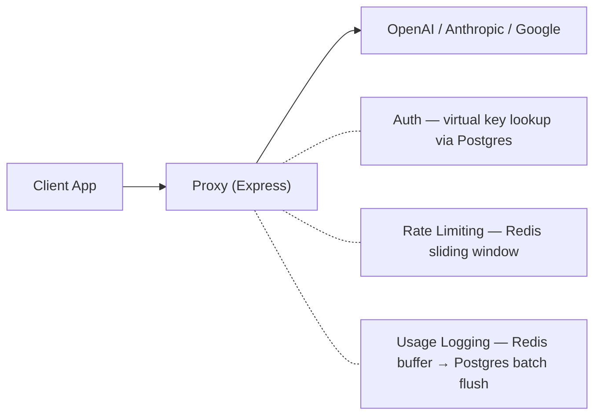
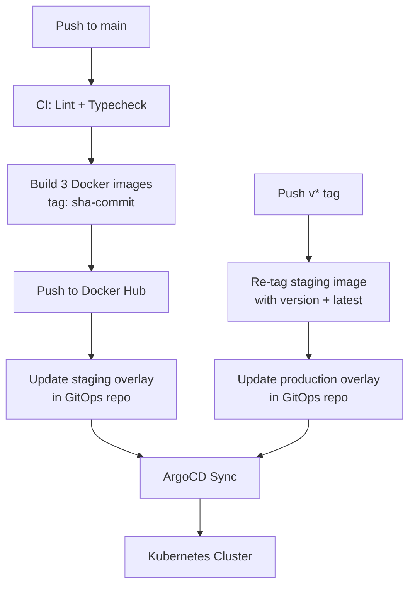

# AI-Gatekeeper

**A unified API gateway for LLM providers with per-project key management, rate limiting, usage analytics, and cost tracking.**


> 🎬 **Demo video coming soon** — a walkthrough of the full workflow will be linked here.

---

## Overview & Motivation

AI-Gatekeeper is an API gateway that sits between client applications and upstream LLM providers (OpenAI, Anthropic, Google). It exposes an OpenAI-compatible `/v1/chat/completions` endpoint, allowing teams to issue scoped virtual API keys per project, enforce rate limits through Redis, and track every request—tokens, latency, cost—in a persistent usage log.

This project was built deliberately as an engineered sandbox to master **Kubernetes orchestration**, **advanced Docker containerization**, and **GitOps-driven deployment pipelines**. Every architectural decision—from the monorepo structure and multi-stage Docker builds to the Kustomize overlays and ArgoCD sync—was made to demonstrate production-grade engineering practices.

---

## Architecture

The system is a **pnpm + Turborepo monorepo** — three deployable apps (`web`, `proxy`, `migrator`) backed by three shared packages (`db`, `redis`, `types`).

<details>
<summary><strong>Monorepo structure</strong></summary>

```
ai-gatekeeper/
├── apps/
│   ├── web/           # Next.js 16 dashboard — project mgmt, key management, usage analytics
│   ├── proxy/         # Express API gateway — routes LLM requests, enforces auth + rate limits
│   └── migrator/      # Init container — runs Drizzle-Kit schema migrations on deploy
├── packages/
│   ├── db/            # Drizzle ORM schema + PostgreSQL client (shared)
│   ├── redis/         # Redis client (shared)
│   └── types/         # TypeScript type definitions (shared)
├── docker-compose.yml
└── docker-compose.dev.yml
```

</details>

### Request Flow



The **web dashboard** (Next.js + tRPC) handles project and team management, virtual API key lifecycle, per-project provider credentials, and usage analytics with token/cost/latency breakdowns.

---

## Containerization Strategy

Each application uses **multi-stage Docker builds** optimized for a monorepo context:

| Stage | Purpose |
|---|---|
| **Base** | `node:20-alpine` — installs `pnpm`, sets up shared dependencies |
| **Pruner** | Runs `turbo prune --docker` to extract only the target app and its workspace dependencies, minimizing build context |
| **Installer** | Installs dependencies with `--frozen-lockfile` and a `--mount=type=cache` for the pnpm store. Runs the `turbo build` for the target app |
| **Runner** | Copies only built artifacts. Creates a non-root user (`UID 1001`) and drops privileges before `CMD` |

**Key optimizations:**
- **`turbo prune --docker`** — generates a minimal dependency subgraph per app, avoiding full monorepo installs in each image
- **BuildKit cache mounts** — persistent pnpm store across builds (`--mount=type=cache`) eliminates redundant downloads
- **Next.js standalone output** — the web image copies only the standalone server + static assets, no `node_modules`
- **Non-root execution** — all containers run as unprivileged users

---

## GitOps Workflow

This repository follows a **strict separation of concerns**: application code and Dockerfiles live here; Kubernetes manifests and cluster configuration live in the dedicated GitOps repository:

**👉 [AI-Gatekeeper-gitops](https://github.com/jklanica/AI-Gatekeeper-gitops)**

### Deployment Pipeline



**Staging** — On every push to `main`, GitHub Actions builds all three images (web, proxy, migrator), tags them with the short commit SHA, pushes to Docker Hub, then patches the staging Kustomize overlay in the GitOps repo. ArgoCD detects the change and syncs.

**Production** — Pushing a `v*` semver tag promotes the exact staging image (by SHA) to production—no rebuild. The image is re-tagged with the version (e.g., `v1.2.0`) and `latest`, and the production Kustomize overlay is updated.

> For the full Kubernetes infrastructure breakdown (ArgoCD, Sealed Secrets, Network Policies, etc.), see the **[GitOps repo README](https://github.com/jklanica/AI-Gatekeeper-gitops)**.

---

## Local Development

### Prerequisites

- **Docker** & **Docker Compose**
- **Node.js** 20+
- **pnpm** 9+

### Quick Start

```bash
# 1. Clone the repo
git clone https://github.com/jklanica/AI-Gatekeeper.git
cd AI-Gatekeeper

# 2. Copy the environment file
cp .env.example .env

# 3. Install dependencies
pnpm install

# 4. Start Postgres + Redis
docker compose -f docker-compose.dev.yml up -d

# 5. Push the database schema
pnpm run db:push

# 6. Start all apps in dev mode (web + proxy with hot reload)
pnpm run dev
```

The web dashboard will be available at `http://localhost:3000` and the proxy at `http://localhost:3001`.

### Full Stack (Docker Compose)

To run the entire production stack locally without any local Node.js tooling:

```bash
docker compose up --build
```

This builds all three application images and starts them alongside Postgres and Redis.

---

## Related

| Repository | Description |
|---|---|
| [AI-Gatekeeper](https://github.com/jklanica/AI-Gatekeeper) | Application source code, Dockerfiles, CI pipelines (this repo) |
| [AI-Gatekeeper-gitops](https://github.com/jklanica/AI-Gatekeeper-gitops) | Kubernetes manifests, Kustomize overlays, ArgoCD configuration |
