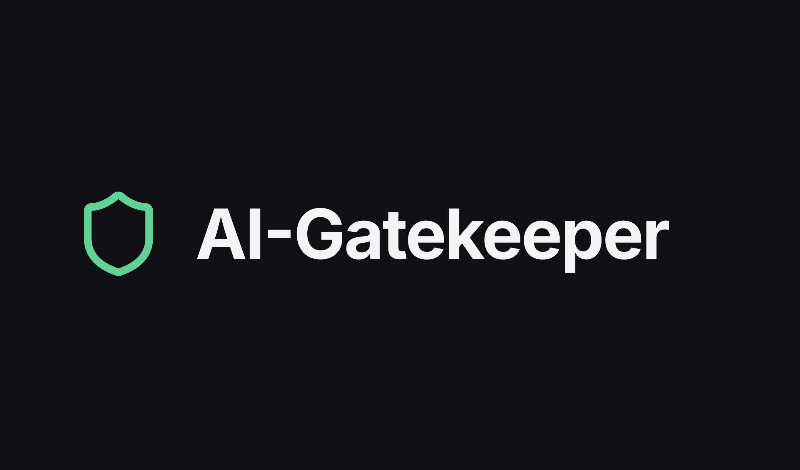
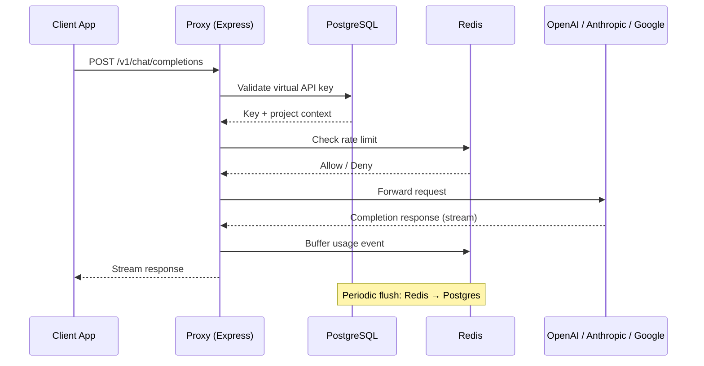
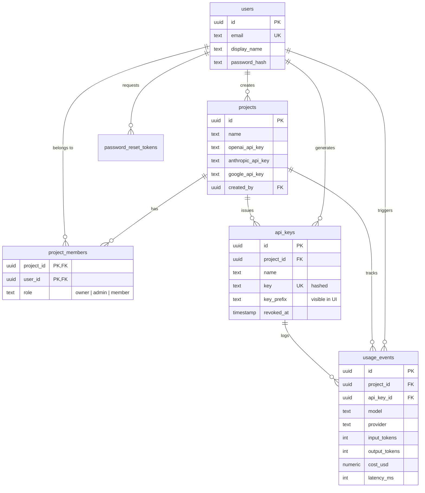
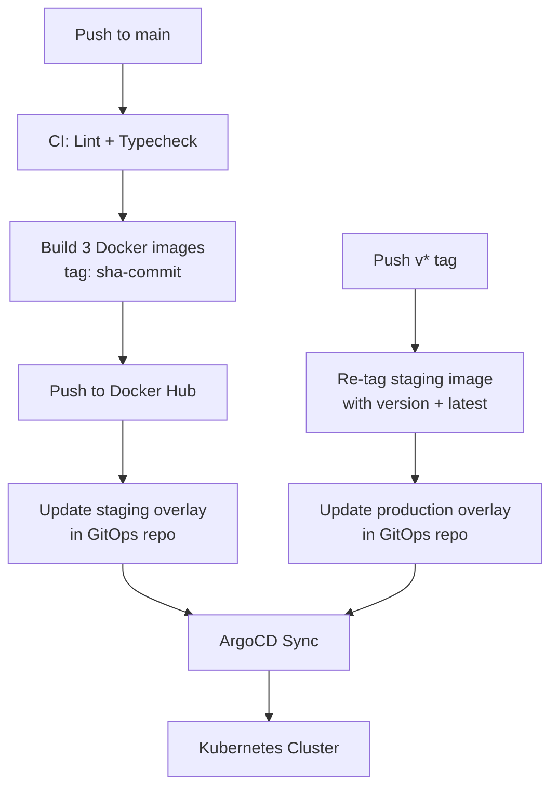

# AI-Gatekeeper

**A unified API gateway for LLM providers with per-project key management, rate limiting, usage analytics, and cost tracking.**


[](https://www.youtube.com/watch?v=3619cH1YwrE)

> 📦 **Kubernetes manifests & GitOps config live in a separate repo → [AI-Gatekeeper-gitops](https://github.com/jklanica/AI-Gatekeeper-gitops)**

---

## Overview & Motivation

AI-Gatekeeper is an API gateway that sits between client applications and upstream LLM providers (OpenAI, Anthropic, Google). It exposes an OpenAI-compatible `/v1/chat/completions` endpoint, allowing teams to issue scoped virtual API keys per project, enforce rate limits through Redis, and track every request—tokens, latency, cost—in a persistent usage log.

This project was built deliberately as an engineered sandbox to master **Kubernetes orchestration**, **advanced Docker containerization**, and **GitOps-driven deployment pipelines**. Every architectural decision—from the monorepo structure and multi-stage Docker builds to the Kustomize overlays and ArgoCD sync—was made to demonstrate production-grade engineering practices.

### Tech Stack

| Technology         | Role in This Project                                         |
| ------------------ | ------------------------------------------------------------ |
| **TypeScript**     | Shared language across all apps and packages                 |
| **Next.js 16**     | Dashboard with SSR, tRPC integration                         |
| **Express**        | Lightweight proxy for the streaming API gateway              |
| **tRPC**           | End-to-end type-safe API between web ↔ server                |
| **Drizzle ORM**    | Type-safe schema, migrations, and queries                    |
| **Zod**            | Runtime validation and shared type inference                 |
| **PostgreSQL 16**  | Persistent storage — users, projects, usage events           |
| **Redis 7**        | Rate limiting + usage event buffer before flush              |
| **Docker**         | Multi-stage monorepo-aware builds                            |
| **Kubernetes**     | Orchestration with Kustomize overlays (staging / production) |
| **ArgoCD**         | GitOps-driven continuous deployment                          |
| **GitHub Actions** | CI/CD — lint, typecheck, build, promote                      |
| **Turborepo**      | Monorepo build orchestration and caching                     |

---

## Architecture

The system is structured as a **pnpm + Turborepo monorepo** with three deployable applications and three shared packages:

```
ai-gatekeeper/
├── apps/
│   ├── web/
│   ├── proxy/
│   └── migrator/
├── packages/
│   ├── db/
│   ├── redis/
│   └── types/
├── docker-compose.yml
└── docker-compose.dev.yml
```

### Applications

**`proxy`** — Express API gateway that exposes an OpenAI-compatible `/v1/chat/completions` endpoint. Routes requests to upstream LLM providers (OpenAI, Anthropic, Google), authenticates via virtual API keys, enforces per-key rate limits through Redis, and buffers usage events for batch persistence to Postgres.

**`web`** — Next.js 16 dashboard for managing projects, team members (RBAC: owner/admin/member), and virtual API keys. Displays usage analytics—tokens, cost, latency—via Recharts. Communicates with the backend over tRPC.

**`migrator`** — Kubernetes init container that runs Drizzle-Kit schema migrations against Postgres before the main services start.

### Shared Packages

**`db`** — Drizzle ORM schema definitions, migrations, and a shared database client. Used by both `proxy` and `web`.

**`redis`** — Shared Redis client configuration and utilities (rate limiting helpers, usage event buffering).

**`types`** — Common TypeScript types and Zod schemas shared across all applications.

### How a Request Is Handled



### Data Model



---

## Containerization Strategy

Each application uses **multi-stage Docker builds** optimized for a monorepo context:

| Stage         | Purpose                                                                                                                                 |
| ------------- | --------------------------------------------------------------------------------------------------------------------------------------- |
| **Base**      | `node:20-alpine` — installs `pnpm`, sets up shared dependencies                                                                         |
| **Pruner**    | Runs `turbo prune --docker` to extract only the target app and its workspace dependencies, minimizing build context                     |
| **Installer** | Installs dependencies with `--frozen-lockfile` and a `--mount=type=cache` for the pnpm store. Runs the `turbo build` for the target app |
| **Runner**    | Copies only built artifacts. Creates a non-root user (`UID 1001`) and drops privileges before `CMD`                                     |

---

## GitOps Workflow

This repository follows a **strict separation of concerns**: application code and Dockerfiles live here; Kubernetes manifests and cluster configuration live in the dedicated GitOps repository:

**👉 [AI-Gatekeeper-gitops](https://github.com/jklanica/AI-Gatekeeper-gitops)**

### Deployment Pipeline



**Staging** — On every push to `main`, GitHub Actions builds all three images (web, proxy, migrator), tags them with the short commit SHA, pushes to Docker Hub, then patches the staging Kustomize overlay in the GitOps repo. ArgoCD detects the change and syncs. Pull requests against `main` run the lint and typecheck jobs without building or pushing images.

**Production** — Pushing a `v*` semver tag promotes the exact staging image (by SHA) to production—no rebuild. The image is re-tagged with the version (e.g., `v1.2.0`) and `latest`, and the production Kustomize overlay is updated.

> For the full Kubernetes infrastructure breakdown (ArgoCD, Sealed Secrets, Network Policies, etc.), see the **[GitOps repo README](https://github.com/jklanica/AI-Gatekeeper-gitops)**.

---

## Key Engineering Decisions

| Decision                                                 | Rationale                                                                                                                |
| -------------------------------------------------------- | ------------------------------------------------------------------------------------------------------------------------ |
| **OpenAI-compatible API surface**                        | Clients can swap in the proxy without code changes — no vendor lock-in for consumers                                     |
| **Buffer usage events in Redis, flush to Postgres**      | Avoids per-request DB writes on the hot path; trades slight write delay for significantly higher throughput              |
| **Promote staging images by re-tagging, not rebuilding** | Guarantees the exact artifact tested in staging is what runs in production (immutable artifact principle)                |
| **Hash API keys, store only a visible prefix**           | Keys are never retrievable after creation; the prefix lets users identify keys in the dashboard without exposing secrets |
| **Separate GitOps repository**                           | Decouples application release cadence from infrastructure changes; ArgoCD watches only the manifest repo                 |
| **Init container for migrations**                        | Schema changes apply atomically before app pods start, preventing version skew between code and database                 |

---

## Local Development

### Prerequisites

- **Docker** & **Docker Compose**
- **Node.js** 20+
- **pnpm** 9+

### Quick Start

```bash
# 1. Clone the repo
git clone https://github.com/jklanica/AI-Gatekeeper.git
cd AI-Gatekeeper

# 2. Copy the environment file
cp .env.example .env

# 3. Install dependencies
pnpm install

# 4. Start Postgres + Redis
docker compose -f docker-compose.dev.yml up -d

# 5. Push the database schema (dev shortcut — see note below)
pnpm run db:push

# 6. Start all apps in dev mode (web + proxy with hot reload)
pnpm run dev
```

The web dashboard will be available at `http://localhost:3000` and the proxy at `http://localhost:3001`.

> **`db:push` vs `migrator`** — In local development, `pnpm run db:push` uses Drizzle's schema-push to sync the database directly. In Kubernetes, the `migrator` init container runs proper Drizzle-Kit migrations instead.

Git hooks are managed by **Husky** — linting and type checking run automatically on every commit.

### Full Stack (Docker Compose)

To run the entire production stack locally without any local Node.js tooling:

```bash
docker compose up --build
```

This builds all three application images and starts them alongside Postgres and Redis.

---

## Related

| Repository                                                               | Description                                                    |
| ------------------------------------------------------------------------ | -------------------------------------------------------------- |
| [AI-Gatekeeper](https://github.com/jklanica/AI-Gatekeeper)               | Application source code, Dockerfiles, CI pipelines (this repo) |
| [AI-Gatekeeper-gitops](https://github.com/jklanica/AI-Gatekeeper-gitops) | Kubernetes manifests, Kustomize overlays, ArgoCD configuration |

---

## License

Licensed under the [Apache License 2.0](./LICENSE).
